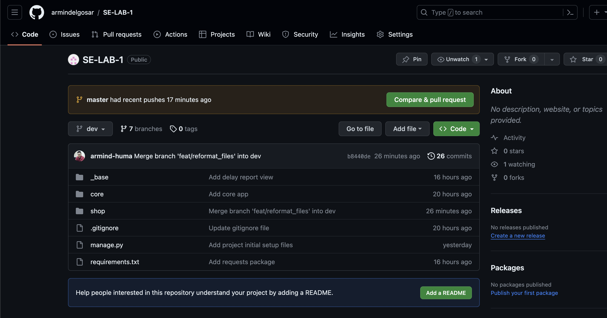
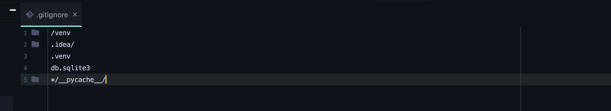
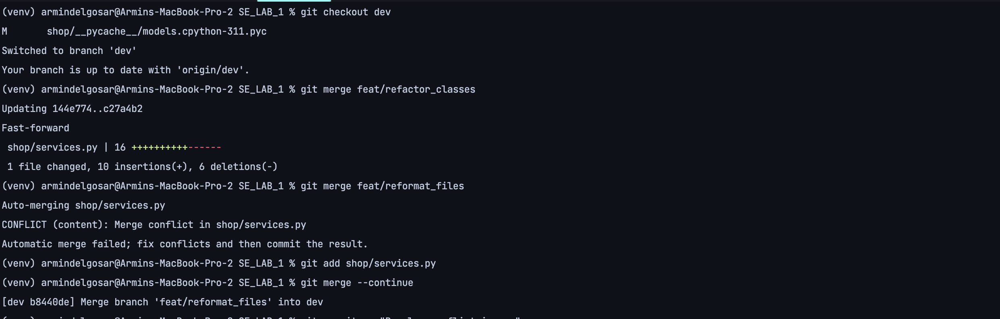
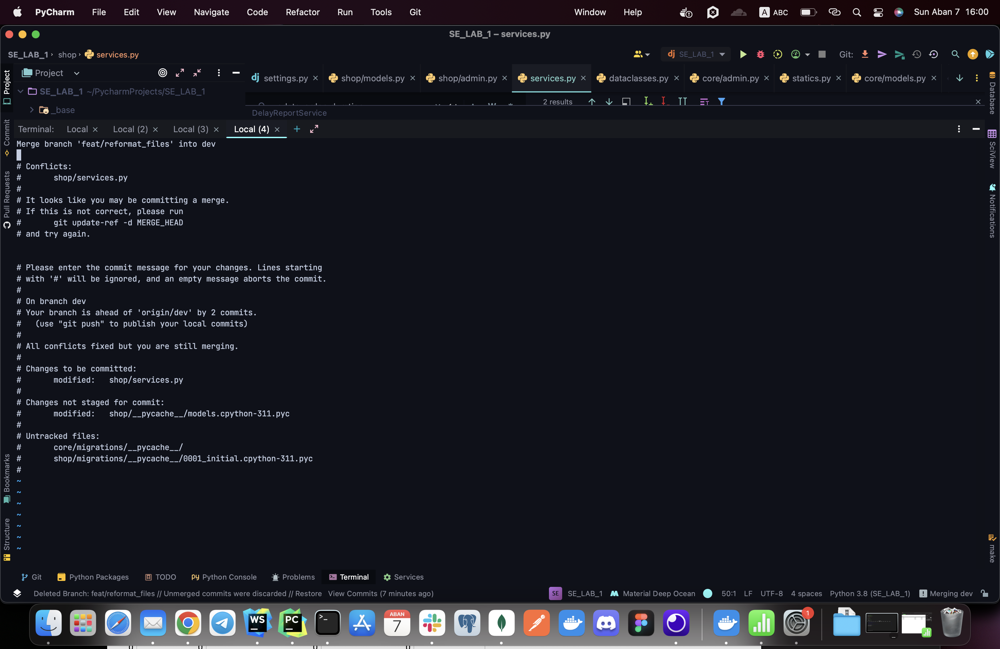
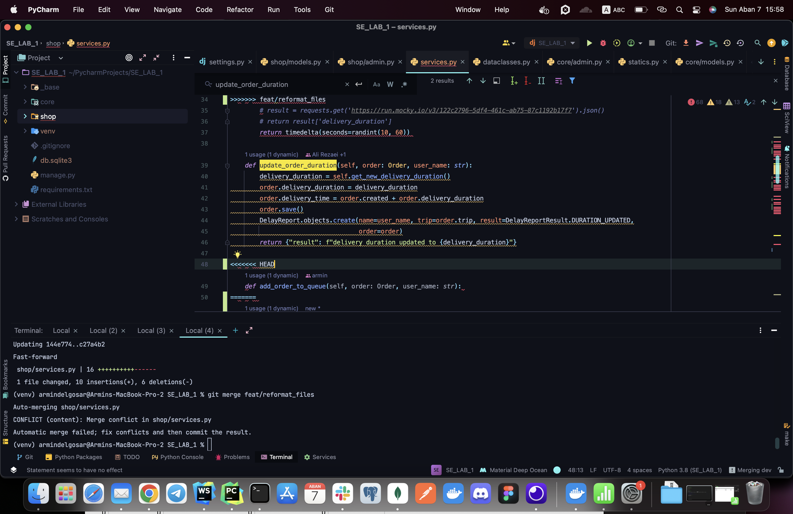
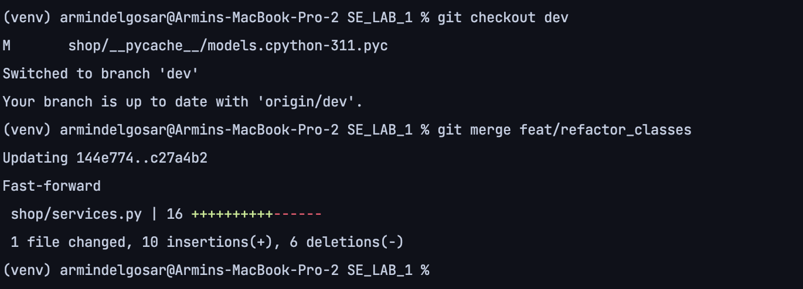
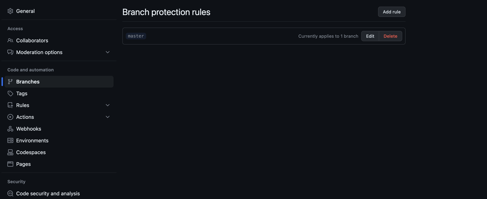
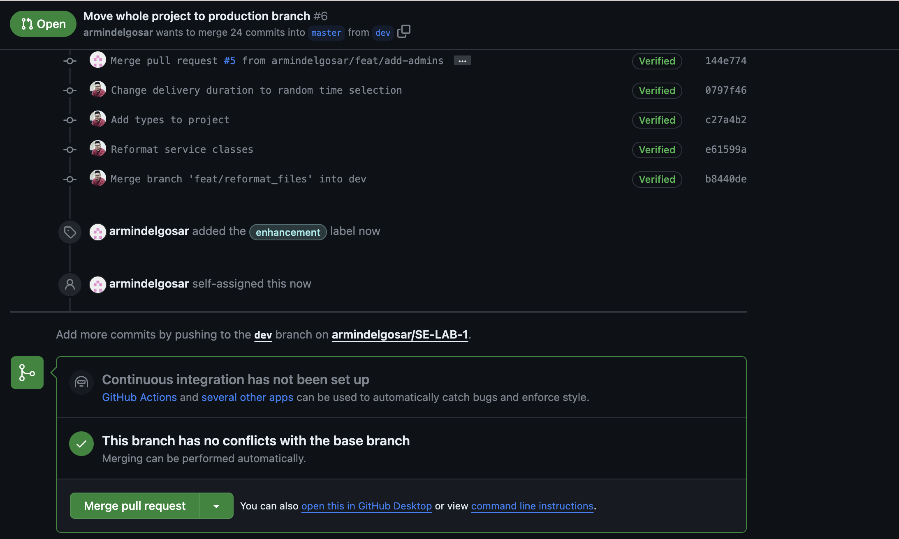

# Delivery delay handling system

The delay handling system is a system designed with aspect of monitoring delay reports occurred while delivering products from vendors to customers.

It is developed using *Django* framework besides *sqlite* database.

### Development steps

1. Here is the project overview which has two main branches:
   `master`, `main ` and we used `feat/[FEATURE_NAME]` pattern to create feature branches.

2. We've added a `.gitignore` file to ignore different directories like cache files and venv dir.

3. We generated some conflict scenarios to handle them using git cmd .e.g there was two branches for refactoring and reformatting which we had to merge them both in dev so there were some conflicts which we resolved and they're shown in screenshots below.

4. As a glance, here are some of our commands used for doing different stuff via git:

5. We changed the default branch to `dev` and made `master` protected branch.

6. We created PR(pull request) in order to add different features to main branches.

